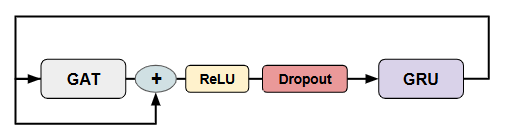

# Traffic Forecasting With A GAT-GRU Hybrid Architecture
*A spatio-temporal graph neural network architecture for traffic forecasting. Final project for Yale CPSC 483/583: Deep Learning on Graph-Structured Data (Fall 2024).*

In the interest of reproducibility, the Jupyter notebooks can be found in the `code` directory. The main notebook is `traffic_gat_gru.ipynb`, while the other one, `prediction_analysis.ipynb` includes code for visualizing what the models predict.

To view the model and the experimental results, go to `code/traffic_gat_gru.ipynb`.  The model was trained on Kaggle, so some filepath references may need to be modified before it can be successfully run. 

All trained model weights can be found in the `kaggle/input` directory. The PEMS04 and PEMS08 datasets are also included in that directory.

Plots of the training/validation loss curves can be found in the `loss-curves` directory.

---

Traffic forecasting is important to many facets of urban planning, particularly real-time traffic management and routing. Here I propose a novel GAT-GRU architecture to perform traffic forecasting. The model combines a Graph Attention Network (GAT) with a Gated Recurrent Unit (GRU) network to learn both spatial and temporal dependencies. Experiments show that the model can outperform multiple state-of-the-art baselines, highlighting the potential of hybrid attention-based graph convolution and recurrent architectures for traffic forecasting.

At each timestep, the GAT generates node embeddings that are passed to the GRU. A skip connection and dropout are used for regularization.

